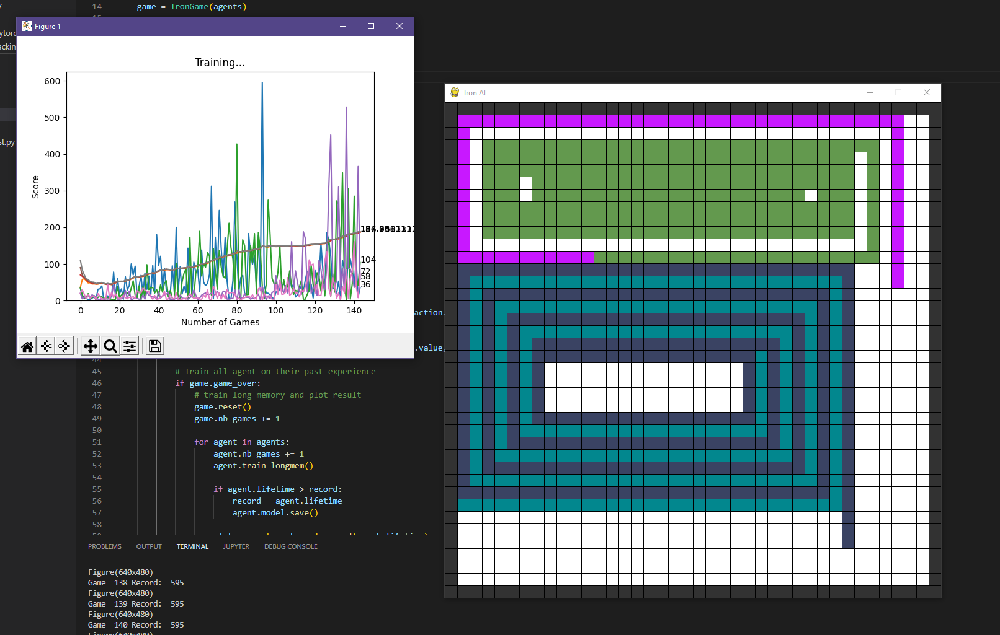

# Tron_AI

A simple Tron game where 4 agents compete with each other to be the last one alive.
Agent uses CNNs as a model and a DQN scheme training.



## Installation

La version 3.10 de python est utilise.
Les librairies requises peuvent etre installe avec la commande suivante.
```sh
pip install -r requirements.txt
```

## Usage example

Run the train python file to start the training.
Hyperparameters and model can be modified directly in the code.
Playing with the reward and penalties expressions can change the behaviours of the agent.

> I will add argument parser in the futur.

## Meta

[Gabriel Combe-Ounkham](https://github.com/gabriel-combe)

Distributed under the GNU GENERAL PUBLIC license. See ``LICENSE`` for more information.